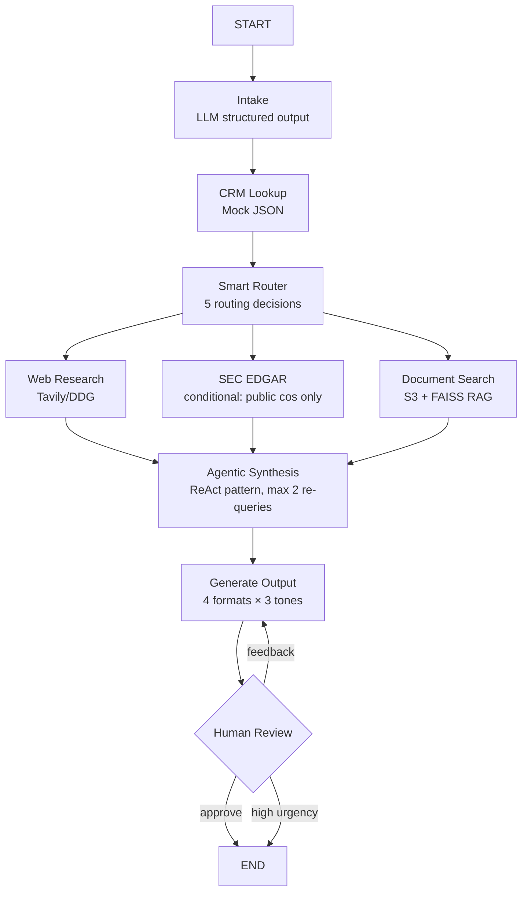

# Sales Deal Acceleration Agent

Multi-system workflow orchestration agent built with LangGraph for automating enterprise sales workflows. A co-sell reference architecture for **LangChain × AWS × Tavily**.

> **Scenario:** Given "Prepare me for tomorrow's call with Snowflake", the agent looks up CRM data, routes to parallel research tools (web search, SEC EDGAR, internal docs via RAG), synthesizes findings, generates formatted output, and supports human-in-the-loop review.

## Architecture



**7 phases, 9 nodes** with parallel fan-out via LangGraph `Send()` API.

## Quick Start

**Prerequisites:** Python 3.11+

```bash
# 1. Clone and configure
git clone https://github.com/srimantht8/sales-deal-agent.git && cd sales-deal-agent
cp .env.example .env
# Fill in API keys in .env

# 2. Create virtual environment
python3 -m venv .venv && source .venv/bin/activate

# 3. Install
make setup

# 4. Run CLI demo (fastest way to verify)
make demo

# 5. Run Streamlit UI
make run
```

### Minimum Configuration

Set these in `.env`:
- `LLM_PROVIDER` — `bedrock` (default), `openai`, or `anthropic`
- Corresponding API key (AWS creds for Bedrock, or `OPENAI_API_KEY`, or `ANTHROPIC_API_KEY`)
- `DOCUMENT_SOURCE=local` — works without AWS S3

> **Bedrock note:** The default model (`global.anthropic.claude-sonnet-4-6`) requires [cross-region inference](https://docs.aws.amazon.com/bedrock/latest/userguide/cross-region-inference.html) to be enabled in your AWS account. If you don't have this, set `LLM_PROVIDER=openai` or `LLM_PROVIDER=anthropic` instead.

For web search: set `TAVILY_API_KEY` or use `SEARCH_PROVIDER=duckduckgo` (zero-config).

## Config Options

| Setting | Default | Options |
|---------|---------|---------|
| `LLM_PROVIDER` | `bedrock` | `bedrock`, `openai`, `anthropic`, `azure`, `vertex` |
| `SEARCH_PROVIDER` | `tavily` | `tavily`, `duckduckgo` |
| `DOCUMENT_SOURCE` | `local` | `local`, `s3` |

### Using S3 for Documents

By default, documents load from `data/documents/` locally. To use S3:

```bash
# 1. Set AWS credentials in .env
# 2. Create bucket and upload documents
make setup-s3

# 3. Switch to S3 in .env
DOCUMENT_SOURCE=s3

# 4. Rebuild the FAISS index from S3
make embed
```

## Project Structure

```
├── agent/
│   ├── graph.py          # StateGraph + compilation
│   ├── state.py          # AgentState TypedDict
│   └── nodes/            # 9 graph nodes across 7 files
├── tools/                # 4 LangChain @tool definitions
├── config/               # Settings + LLM factory
├── data/
│   ├── crm/              # Mock CRM (5 companies)
│   └── documents/        # 12 docs across 4 deal stages
├── ui/app.py             # Streamlit interface
├── eval/                 # Evaluation suite + LangSmith integration
├── infra/                # AWS CDK stack (ECS Fargate + ALB)
├── tests/                # Unit + integration tests (no LLM needed)
├── scripts/
│   ├── demo.py                # CLI demo
│   └── provider_comparison.py # Multi-cloud benchmark
└── Dockerfile                 # Container deployment
```

## Mock Data — 5 Routing Paths

| Company | Public | Stage | Relationship | EDGAR | Tone |
|---------|--------|-------|-------------|-------|------|
| Snowflake Inc | ✓ | Discovery | Neutral | ON | Professional |
| NovaCrest Financial | ✓ | Negotiation | Positive | ON | Confident |
| Meridian Health Systems | ✗ | Evaluation | At-risk | OFF | Empathetic |
| AuroraStack Technologies | ✗ | Renewal | Positive | OFF | Confident |
| Vertex Logistics Group | ✓ | Evaluation | At-risk | ON | Empathetic |

## Demo Queries

1. `"Prepare me for tomorrow's call with Snowflake"` — public + discovery + normal urgency
2. `"Draft a follow-up email to Meridian Health after last week's tough meeting"` — private + at-risk + empathetic
3. `"What should I send to NovaCrest Financial for our pricing discussion?"` — negotiation + confident
4. `"Research AuroraStack Technologies for our upcoming renewal review"` — renewal + research_only
5. `"Prepare for the Vertex Logistics evaluation — they're comparing us against competitors"` — evaluation + at-risk

## Design Decisions

- **Send() API for parallel fan-out**: Enables conditional parallelism (SEC EDGAR only for public companies) with clean fan-in at synthesis.
- **Manual ReAct loop for synthesis**: Simpler than `create_react_agent` subgraph — avoids `messages` in state, easy re-query tracking (max 2).
- **Structured output for intake**: `with_structured_output()` guarantees valid parsed queries.
- **FAISS with disk caching**: Auto-builds on first run, caches to `data/faiss_index/` for speed.
- **Local-first with S3 production path**: `DOCUMENT_SOURCE=local` for zero-config quickstart; set `DOCUMENT_SOURCE=s3` for production. CDK stack (`infra/`) provisions the bucket and syncs documents via `make setup-s3`.
- **Graceful degradation**: Works with missing Tavily (falls back to DDG), missing S3 (loads local docs), missing SEC EDGAR (skips for private companies).

## Tests

```bash
pytest tests/ -v    # 34 deterministic tests, no LLM calls needed
```

Covers routing logic (all 5 decisions), Send() fan-out (public vs private paths), CRM lookup (exact/partial/case-insensitive matching, error handling), node-level defaults on CRM miss, S3/local document loading, and full graph integration (public company pipeline, private company pipeline, high-urgency auto-approval).

## Evaluation

```bash
make eval          # Push results to LangSmith dashboard
make eval-local    # Console-only mode (no LangSmith needed)
```

Runs 5 test queries covering all routing paths and measures:
- **Routing accuracy** — do routing decisions match expected values?
- **Tool selection correctness** — was SEC EDGAR called only for public companies?
- **Output quality** — LLM-as-judge scoring (0-1) on relevance, completeness, actionability
- **Confidence calibration** — does confidence correlate with data availability?

Results are pushed to LangSmith as experiments with per-metric scores visible in the dashboard.

## Tech Stack

- **Framework**: LangGraph (StateGraph, Send(), interrupt())
- **LLM**: Anthropic Claude via AWS Bedrock (primary), OpenAI/Anthropic direct (alternatives)
- **Embeddings**: Amazon Titan Embed Text v2 via Bedrock
- **Tools**: Tavily web search, SEC EDGAR EFTS API, FAISS vectorstore (S3/local docs), mock CRM
- **UI**: Streamlit
- **Observability**: LangSmith

## Additional Capabilities

- **Evaluation suite** — 4 metrics across 5 routing paths, LangSmith dashboard integration (`make eval`)
- **Web interface** — Streamlit UI with expandable research sections, human-in-the-loop approve/revise (`make run`)
- **Multi-cloud comparison** — Benchmark across 5 LLM providers: AWS Bedrock, OpenAI, Anthropic, Azure OpenAI, GCP Vertex AI (`make compare`)
- **Infrastructure as Code** — AWS CDK stack in `infra/`: S3 + doc sync, ECS Fargate, ALB, Secrets Manager, IAM for Bedrock (`make deploy-infra`)

## Friction Log

See [`FRICTION_LOG.md`](FRICTION_LOG.md) — 11 issues documented with specific improvement suggestions for LangChain, LangGraph, LangSmith, and AWS Bedrock.

---

Built by **Srimanth Tangedipalli**
